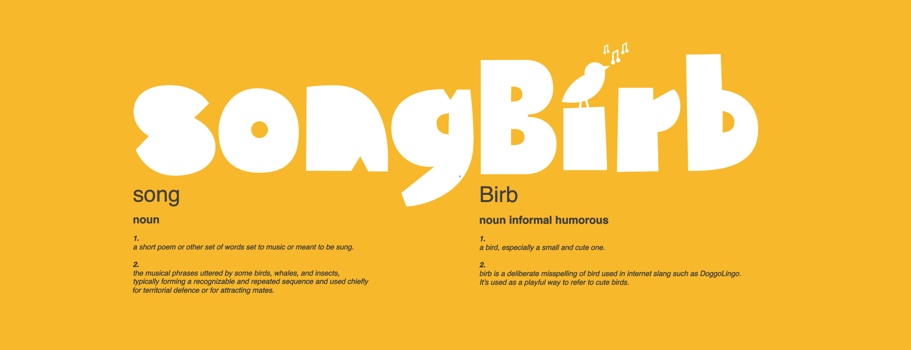

 
 
 

- [**ABOUT SONGBIRB**](#about-songbirb)
- [**INITIAL WIREFRAMES**](#initial-wireframes)
- [**UX (USER-EXPERIENCE)**](#ux-user-experience)
- [**USER STORIES**](#user-stories)
- [**LOGO**](#logo)
- [**COLOR PALETTE**](#color-palette)
- [**FAVICON**](#favicon)
- [**GAME OVERVIEW**](#game-overview)
- [**INTRO SPLASH SCREEN**](#intro-splash-screen)
- [**RULES MODAL**](#rules-modal)
- [**AUDIO CONTROL**](#audio-control)
- [**THE GAME TILES**](#the-game-tiles)
- [**THE KEYBOARD**](#the-keyboard)
- [**WIN AND RELOAD**](#win-and-reload)
- [**LOSE AND RELOAD**](#lose-and-reload)
- [**FUTURE FEATURES**](#future-features)
- [**LANGUAGES USED**](#languages-used)
- [**RESOURCES**](#resources)
- [**MANUAL TESTING**](#manual-testing)
- [**AM I RESPONSIVE**](#am-i-responsive)
- [**MOBILE RESPONSIVENESS**](#mobile-responsiveness)
- [**VALIDATION**](#validation)
- [**BUGS**](#bugs)
- [**KNOWN ISSUES**](#known-issues)
- [**DEPLOYMENT**](#deployment)
- [**HOW TO FORK**](#how-to-fork)
- [**HOW TO CLONE**](#how-to-clone)
- [**VERSION CONTROL**](#version-control)
- [**CREDITS**](#credits)
- [**MUSIC**](#music)
- [**ACKNOWLEDGEMENTS**](#acknowledgements)

 
 
 

# **ABOUT SONGBIRB**

The simple goal of songBird is to help people to learn the songs of various songbirds.
With enough practice they should be guessing the songs on the first go of songBirb and
then be able to recognise the birdsong in the outdoors whether on a walk or in their back gardens.

 
 
 

# **INITIAL WIREFRAMES**
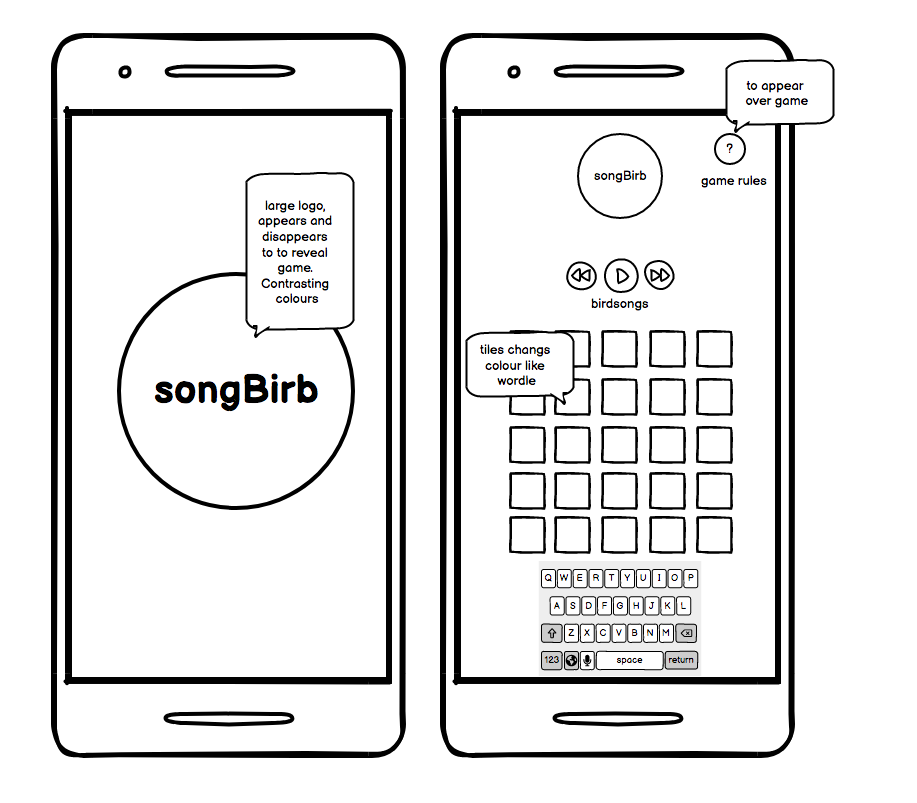
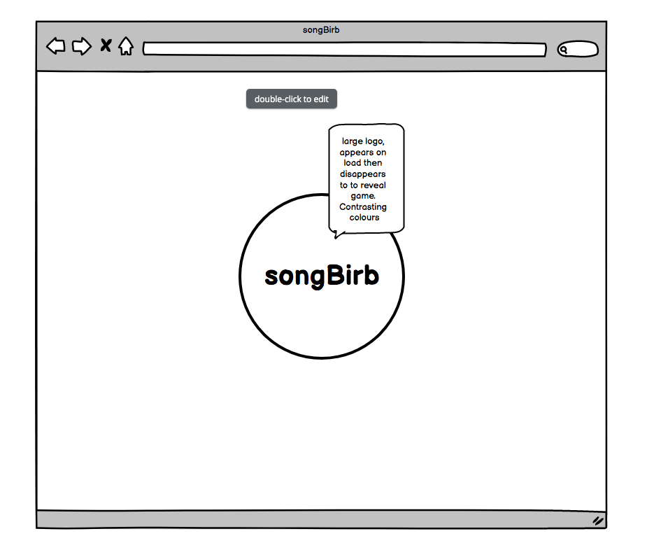
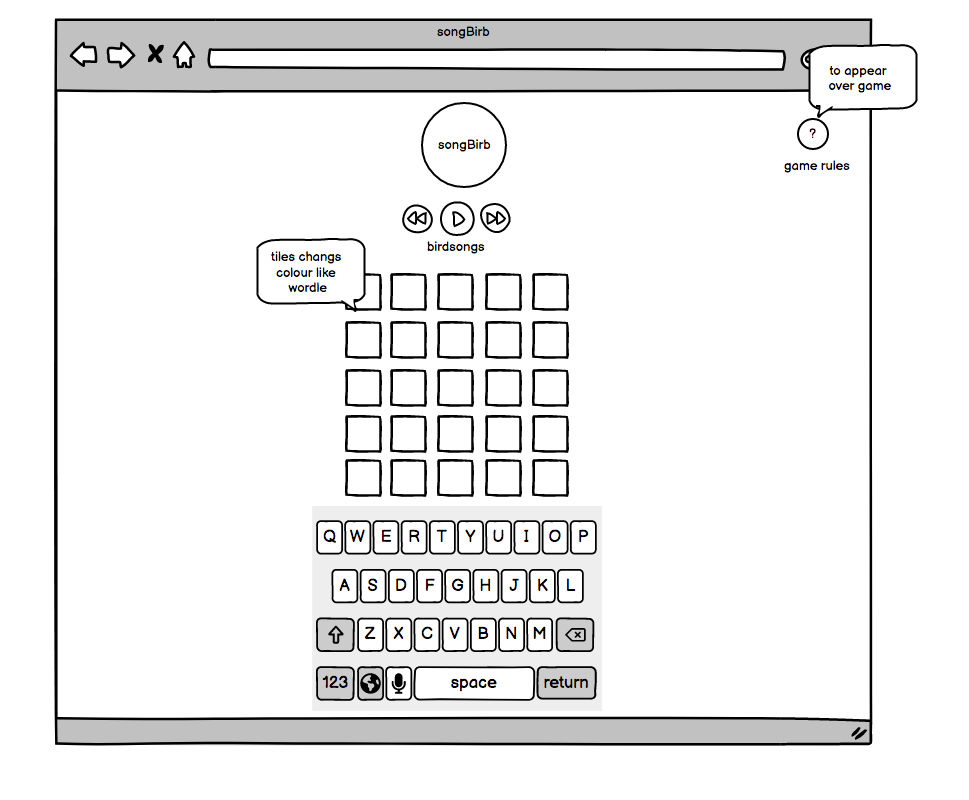

 
 
 

# **UX (USER-EXPERIENCE)**
The target audience is both broad and narrow at the same time. 
From 8 to 80, the only requirement is an interest in birds. 

Maybe a more niche hobby in the past I think the lockdowns of recent years have given a broader range of people an interest in nature and in particular birdlife and the their songs. The dawn chorus never seemed louder than during those early extreme lockdowns, without so many cars on the road and planes in the sky. A much needed bright spot during grim times. 

Even experienced birdwatchers can struggle to recognise the individual calls and they can seem baffling to newcomers. But a little knowledge of birdsong can really add to the experience of birdwatching or enhance a walk to the woods or park. 

 
 
 

# **USER STORIES**

**Visitor Goals**

* I want to be able to discern the purpose of the site quickly
* I want to be able to find out how to play the game if necessary
* I want to be able to play the game as many times as I like
* I want be able to reset the game easily
* I want to learn the songs of birds

 
 
 

# **LOGO**

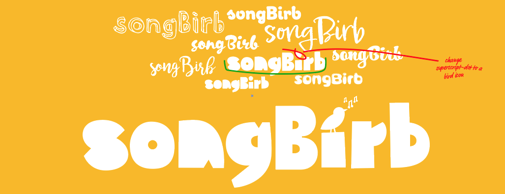

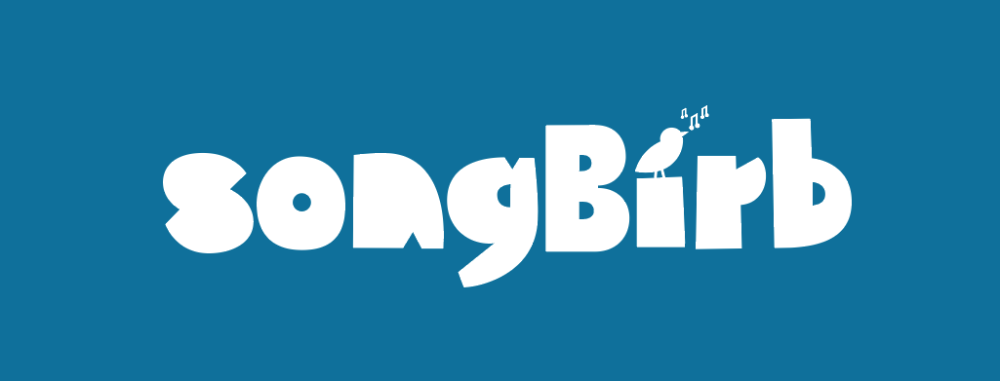

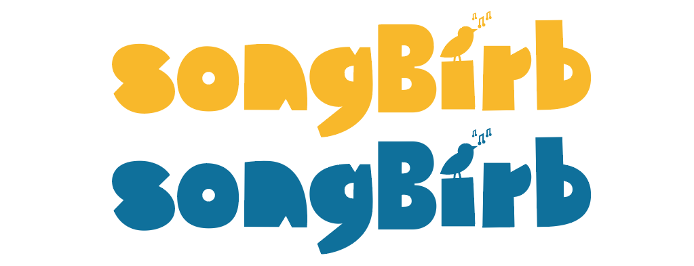

I used a simple font for the other elements in the game so that everything is easy to read so I thought that I could use a more interesting font for the name. I group a bunch of possibilities together and in the end I chose a font called Embryo.

I felt it was eyecatching and suited the quirky title. I just adjusted the kerning and replaced the superscript-dot over the i with a simple bird icon. I arranged the logo camelCase as a little nod to the javascript module. I like the blocky format and it works well as a solid color or reversed out of a background color.

 
 
 

# **COLOR PALETTE**
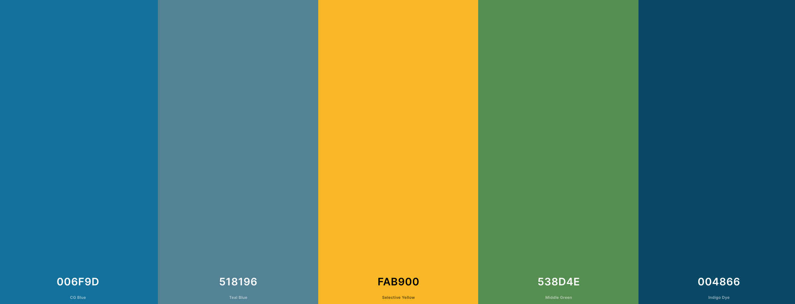

 
 
 

# **FAVICON**
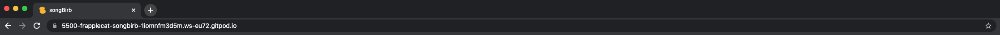

I selected the 's' from songBirb as the favicon.

 
 
 

# **GAME OVERVIEW**

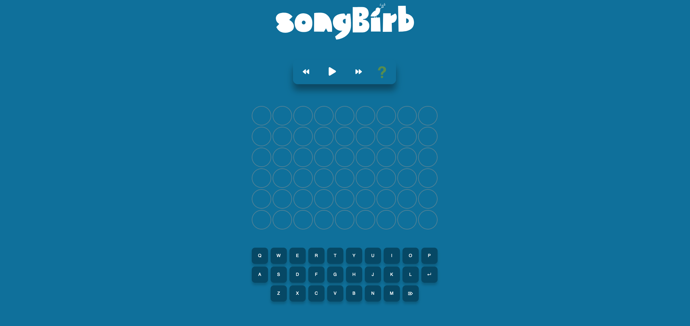

The game in based on the famous Wordle. I've tried to change some of the key components so the overall look is different though, from the colour scheme to the key and tile shapes. 
A big difference is the audio aspect and the fact it's to be used as a learning aid. 
To begin the user presses play on the audio navigation button and listens to the birdsong that is played. Then they can proceed to the birdname guess part of the game. Once a birdname is typed in and the enter button (↵) is clicked, it will trigger a flipping animation on the tiles and change the tile colour depending on whether a letter is present in the birdname, or not. If present in the birdname but in the wrong place, or present in the birdname and in the correct place, or not in the birdname at all. At the same time, the keyboard keys used also change to the relevant colour.
With each guess the user will should re-listen to the birdsong and over time will hopefully come to 
recognise each tune and eventually be able to guess the bird on the first go!

 
 
 

# **INTRO SPLASH SCREEN**

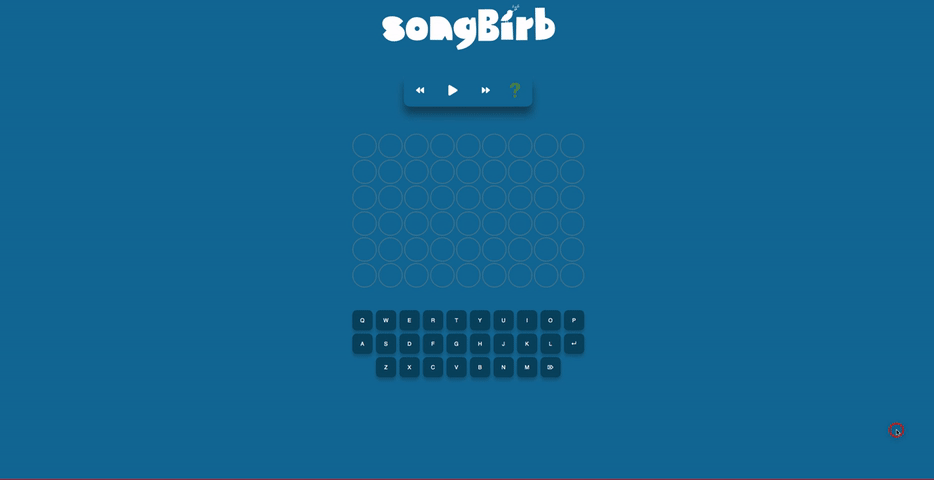

I've added a splash screen on initial loading of the game. It contains the songBirb logo and the line:
Time to learn some birdsong. This should give the user an instant idea of what the site is about.
I set the intro page so it loads and disappears quickly so it doesn't delay the user too much.
I also wanted to use a brighter colour on the intro screen against the blue of the main game to provide some extra contrast and separation between the two elements. I've put the tag-line in the songbirb green so it doesn't get lost on the white logo during the animation. After this initial load the intro gets put into local storage and won't load again so it doesn't annoy a user who is going to play multiple game in a row.
If you want to get the intro to load again you just remove the key from local storage. I've included a gif above with the process.

 
 
 

# **RULES MODAL**

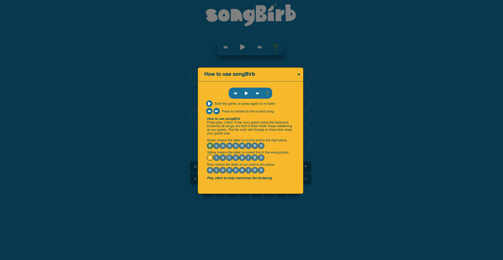
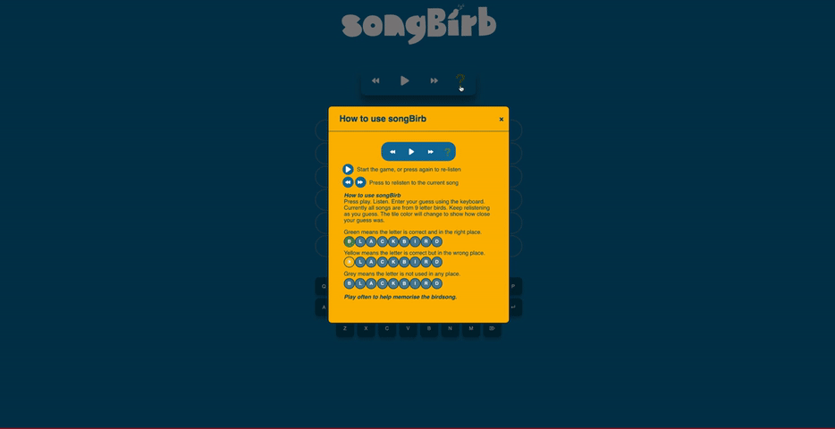

I want the user to be able find out what the purpose of the site is easily and to understand how to play the game. With this in mind I included a modal that fills the screen when the ? button is clicked. While the modal is active it overlay covers the rest of the screen and prevents the user from accessing the game until it's closed. The modal can be close using the x in the top right of the info panel or for ease of use just by clicking the overlay background itself. I include the rules modal button with the audio navigation to create a compact arrangement of all the game buttons that would also be more mobile screen size friendly.

 
 
 

# **AUDIO CONTROL**

The audio navigation is simple set-up. The play button is largest button and begins the game. There is also a prev and next button that I've re-purposed so either of them can be pressed to re-listen to the current song. 
Re-listening is crucial to help memorise the song so I wanted that to be as easy as possible with putting the song on a continuous loop. Once playing a progress bar pops-up to give a guide to how long the particular birdsong will play.
 
 

# **THE GAME TILES**

I've changed the game tiles to a circle format to differentiate the layout from Wordle.
At the moment it's currently arranged for a 9 letter birdname.

 
 
 

# **THE KEYBOARD**

I tried a circle format for the keyboard as well but I felt it was too much with the tiles and didn't balance on screen. So switched to a square format with a rounded corner that is also reflected in the audio nav component and modal. Yellow hover when using a mouse. Also works by linking to a desktop keyboard.
Key colours change to match the tiles.

 
 
 

# **WIN AND RELOAD**

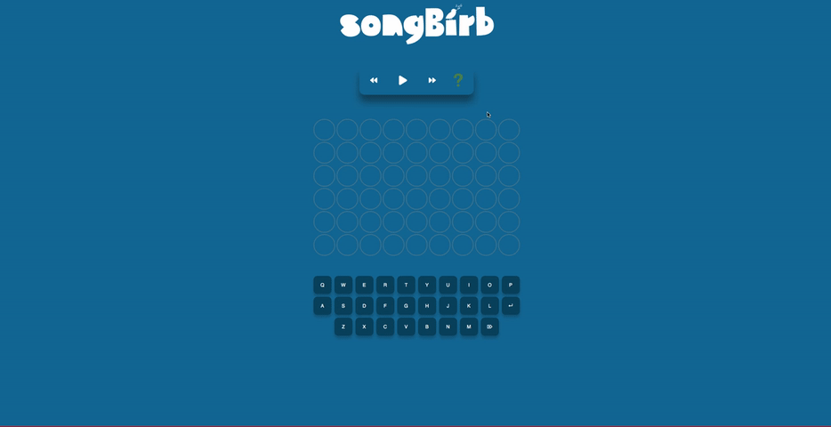

I hope that the user will want to play multiple times so on WIN a congratulations message will
pop-up with the option to try again. I have set it up so after the initial load the intro page 
gets put into local storage and won't load again for game reload.

 
 
 

# **LOSE AND RELOAD**

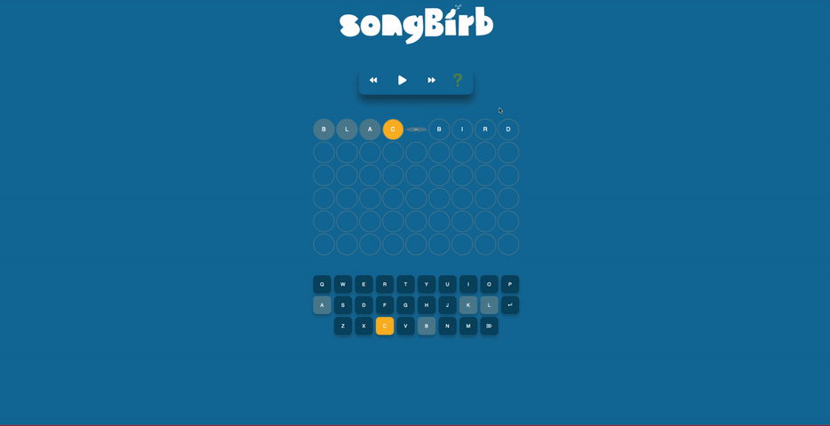

I hope that the user will want to play multiple times so on LOSE a message with the correct bird name will
pop-up with the option to try again. I have set it up so after the initial load the intro page 
gets put into local storage and won't load again for game reload.

 
 
 

# **FUTURE FEATURES**

There are so many features that I'd like to add given more time and skill.
* Expand the library to include many more birds, with names of different lengths.
From wren to nightingale.
* Add code so the tiles would change to suit the length of birdname.
* Add options so the user could adapt the game to their needs, e.g. be able to select 
birds to guess by location. Or to be able to orangise a personal array of birdsongs to learn.
* Add ability to track their progress, keep their statistics on record.

 
 
 

# **LANGUAGES USED**

* HTML
* CSS
* Javascript
* Markdown

 
 
 

# **RESOURCES**

* **Balsamiq** - to create wireframe website mockups
* **Gitpod** - to create the website and version control
* **Github** - to save and store the files for the website
* **Adobe Illustrator** - to create the logo and various headings
* **Adobe InDesign** - ran the README text through InDesign's spell-checker
* **Am I Responsive** - to display the website on a range of devices
* **Responsivedesignchecker.com**- to check the display of the website on a range of devices
* **Font Awesome** - for icons
* **Favicon.io** -  to create a favicon
* **Xeno-canto.org** - for birdsong audio
* **Google Dev Tools** - for troubleshooting and testing fixes
* **W3C HTML & CSS Validators** - to test HTML and CSS code
* **JS Hint** - to test javascript
* **Slack, Stackoverflow, Youtube, Google, W3C Schools** - for help with troubleshooting errors
* **Coolors.co** - to check colour contrast
* **W3C Spell Checker** - to check website spelling
* **Freeconvert.com** - to compress mp4
* **Ezgif.com**- to convert compressed mp4 to gif for README
* **Record It Pro** - for screen-capturing video and converting mp4 to gif
* **GitHub Wiki TOC generator** - for generating README Table of Contents

 
 
 

# **MANUAL TESTING**
* I manually tested each button in different browsers and at different sizes.
* I checked responsiveness using web dev tools in Chrome and Firefox. I manually resized each page to check flow and behaviour. I viewed the site at various sizes: desktops to mobiles.
* I also used **[Responsive Design Checker](https://responsivedesignchecker.com)** to check the website performance on a range of devices.
* I used the W3C Spell Checker to check website spelling.

 
 
 

# **AM I RESPONSIVE**
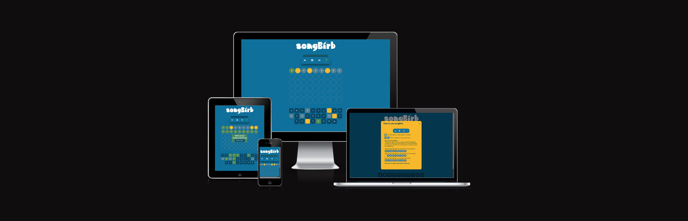

 
 
 

# **MOBILE RESPONSIVENESS**
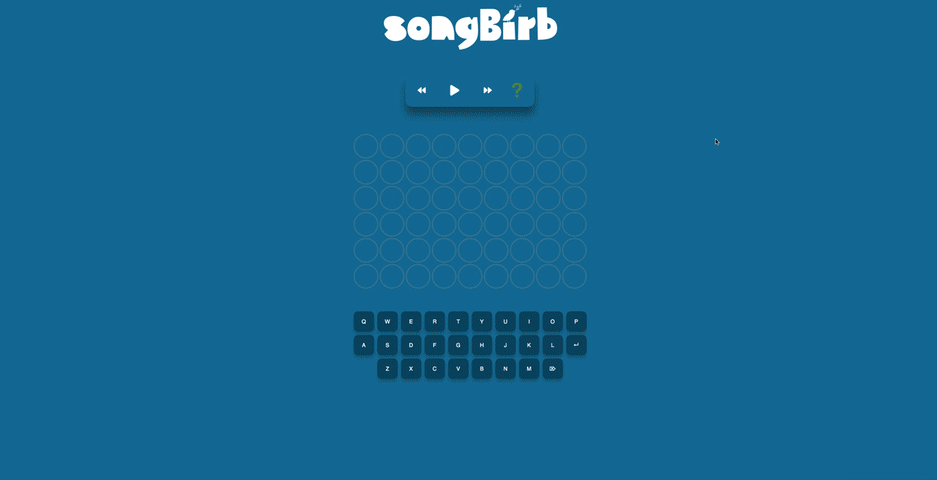
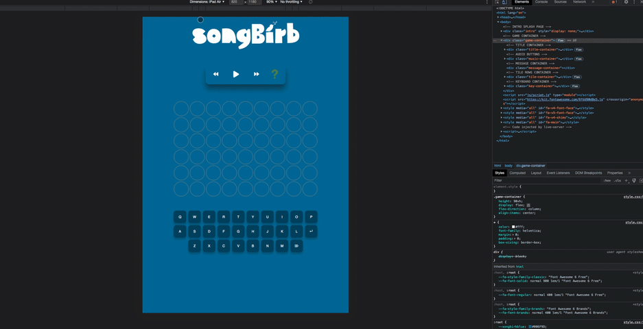

 
 
 

# **VALIDATION**
**HTML Validator**

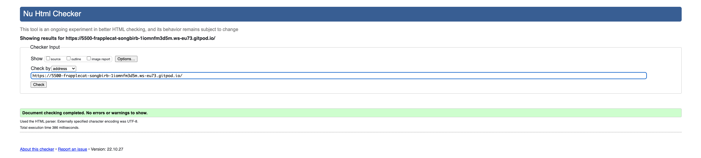

 
 
 

**CSS Jigsaw**

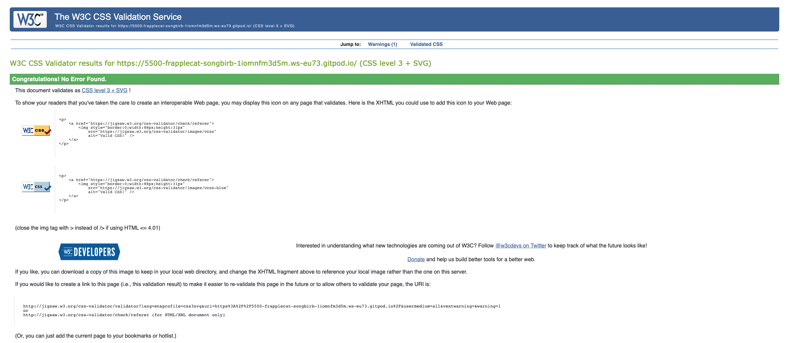

 
 
 

**JS Hint**

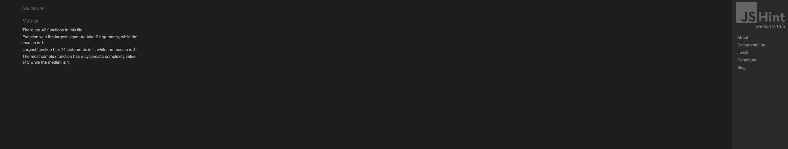

 
 
 

**Lighthouse**

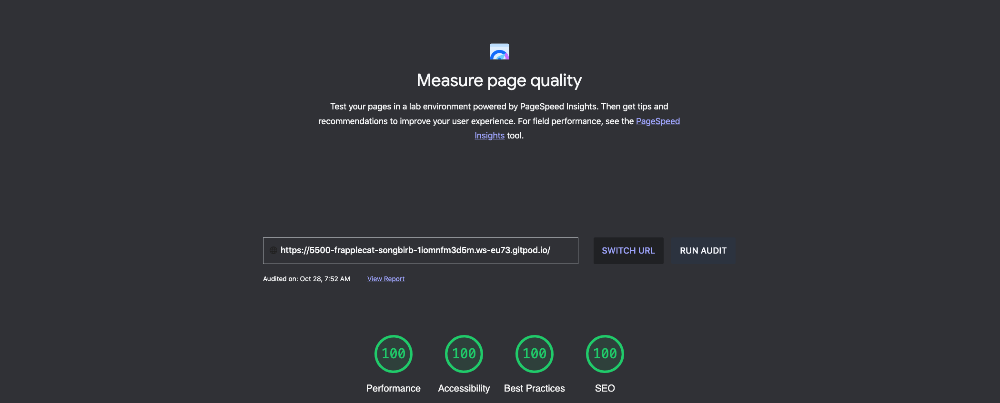
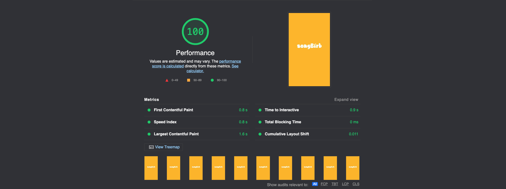
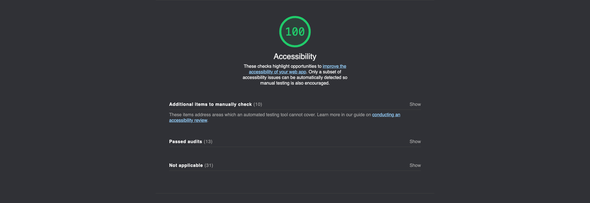
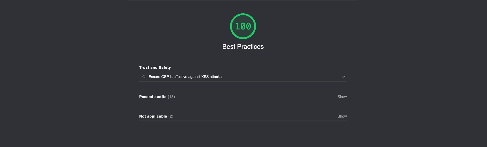
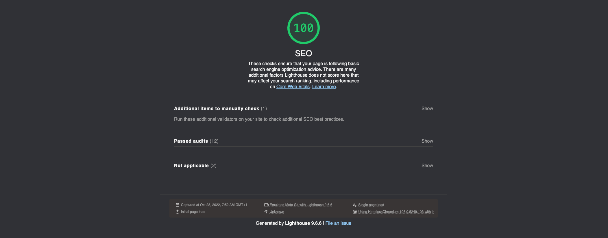

 
 
 

**Wave**

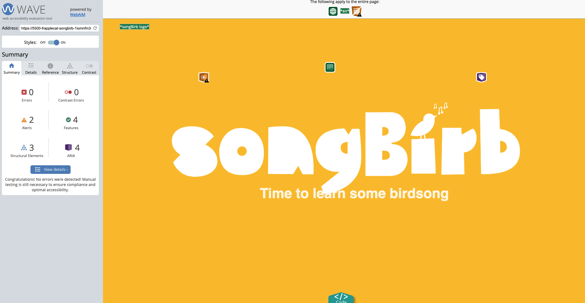
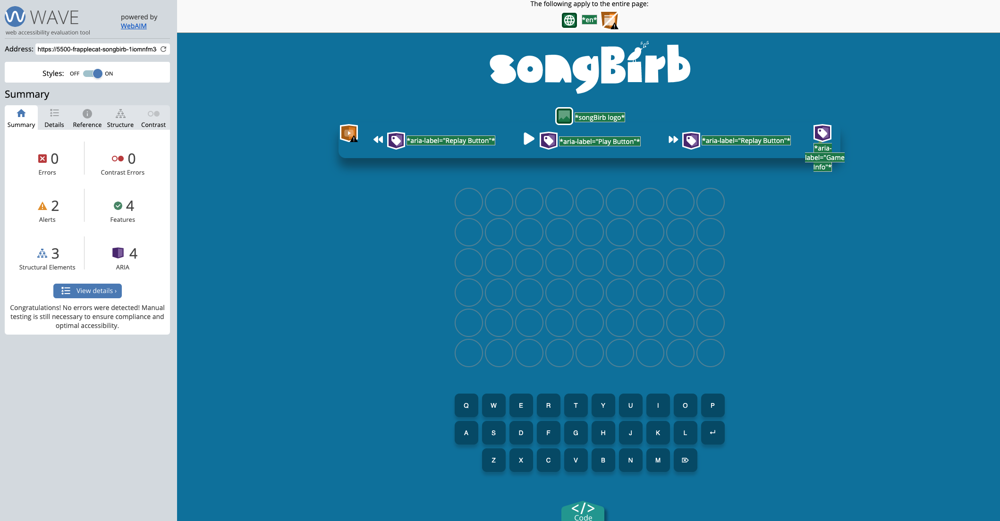

 
 
 

# **BUGS**

* **Expected** - the game to work well on mobile, tablet and desktop.
* **Testing** - launched website using terminal, used web dev tools to test the game at various sizes. 
* **Result** - I noticed a of small amount horizontal scroll at mobile-screen sizes.
* **Fix** - I adjusted my CSS media queries to correct it.

---

* **Expected** - when the info modal was activated it would overlay the game container and all its elements.
* **Testing** - launched website using terminal, initially just tested the desktop view. 
* **Result** - once the info modal was selected some of the buttons for the audio naviagtion appeared over the info screen.
* **Fix** - I added a Z-index to correct the problem.

---

* **Expected** - on completion of the game, win or lose, the game is over and has to be refreshed to play again.
* **Testing** - launched website using terminal, initially just tested the desktop view. 
* **Result** - noticed that on completion of the game, after the win/lose/try again message pops up you could still access the tiles and delete letters.
* **Fix** - in the javascript I had a line 'isGameOver = false;', changed to 'isGameOver = true;' to fix the error.

---

* **Expected** - on completion of the game, win or lose, the game message would appear over the game board, slightly transparent so you can see the tiles underneath it.
* **Testing** - launched website using terminal, initially just tested the desktop view. 
* **Result** - noticed that on completion of the game, after the win/lose/try again message pops up the game tile briefly appeared over the message box when flipping over.
* **Fix** - I added a Z-index to the message container to keep it above the tiles.

---

* **Expected** - the game's on screen keyboard to be accessible by mouse click or, to be more user friendly, to also link to the keypresses on a wired-keyboard. 
* **Testing** - launched website using terminal, initially just tested the desktop view. 
* **Result** - noticed that the keydown event listener I'd added worked for A-Z letters but not Delete or Enter.
* **Fix** - I added if statements and targeted those 2 keys separately.

---

* **Expected** - the intro page plays on first load, after playing a game and refreshing the page via the button the intro page won't play again. 
* **Testing** - launched website using terminal, initially just tested the desktop view. 
* **Result** - site started stalling on the intro screen.
* **Fix** - I was using the wrong scope for the intro variable, changed from const to let to fix the problem.

 
 
 

# **KNOWN ISSUES**

* There is an issue with the green and yellow overlay and the letter-index if a letter appears more that once in a word.
* Sometimes on refresh after winning or losing a game the intro screen very briefly appears even though
it is set to display: none. Only seems to happening intermittently.

 
 
 

# **DEPLOYMENT**

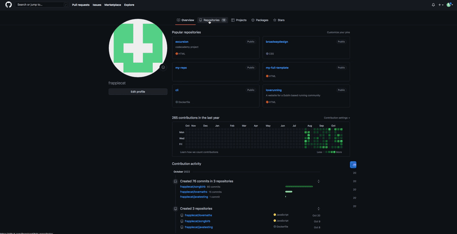

* The site was deployed to GitHub pages 

* The steps to deploy are as follows:
* Go to GitHub and select the repository for the project
* Navigate to the Settings tab
* Select Pages from the left hand navigation window
* Select Deploy from a branch under the source drop-down menu
* Select main from the Branch dropdown menu
* Make sure the /root folder is selected and press save
* The site has now been deployed, it may take a few minutes before it is live
* Here is the deployed link: https://frapplecat.github.io/songbirb/

 
 
 

# **HOW TO FORK**

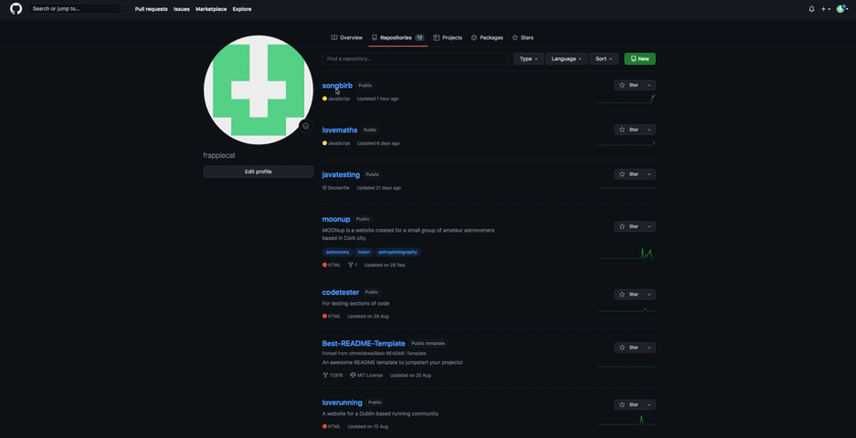

* Login/signup to GitHub.
* Locate the relevant repository, for example: https://github.com/frapplecat/songbirb
* Click on the 'Fork' button in the top right corner.
* The forked version of this repo will be generated.

 
 
 

# **HOW TO CLONE**

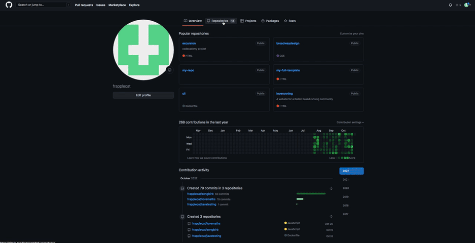

* On GitHub.com, navigate to the main page of the repository.
* Above the list of files, click  Code.
* Copy the URL for the repository.
* To clone the repository using HTTPS, under "HTTPS", click the clipboard icon for copying the URL.
* Open Terminal.
* Change the current working directory to the location where you want the cloned directory.
* Type git clone, and then paste the URL you copied earlier.
* $ git clone https://github.com/YOUR-USERNAME/YOUR-REPOSITORY
* Press Enter to create your local clone.

 
 
 

# **VERSION CONTROL**

I used GITPOD for version control software. Regular git add ., git commit -m, and git push were used to add, save and push the code to the GITHUB Reop where the source code is stored. I adjusted my git commit messages formatting midway through the project to reflect the feedback from my Portfolio 1 Assessment report.

 
 
 

# **CREDITS**

* The overall concept is based on the Wordle game
* Intro splash page **[tutorial](https://www.youtube.com/watch?v=2ak37WrbSDg)** by Conor Bailey was very instructive. 
* I referenced many youtube tutorials on wordle clones but in particular **[Ania Kubów](https://www.youtube.com/watch?v=mpby4HiElek)**.
* Modal overlay **[tutorial](https://www.youtube.com/watch?v=MBaw_6cPmAw)** by Web Dev Simplified was excellent:
* A **[tutorial](https://www.youtube.com/watch?v=QTHRWGn_sJw)** on audio by Traversy Media was very useful:

 
 
 

# **MUSIC**

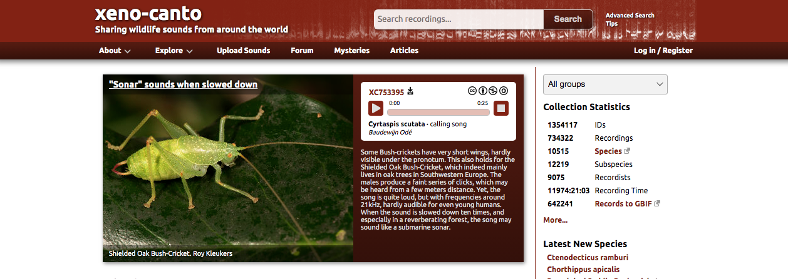

The birdsongs used were all selected from **[Xeno-Canto](https://xeno-canto.org)**.
Sharing wildlife sounds from around the world. A wonderful website.

 
 
 

# **ACKNOWLEDGEMENTS**

* Thanks to the Code Institute Tutors, Sean & Kevin. They helped me with many issues, from arrays to keydowns
* Huge thanks to another Code Institute Tutor, Ed, who solved an issue with my intro page and local storage.
* Thanks as well to my Code Institute Mentor, Mitko Backvarov, for his support and encouragement.
